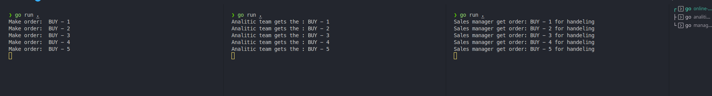

# Example of the Kafka interaction

In this example I had tried simulating the online store work that should sale some imagine good and place the order to the kafka queue.
In other hand, the are two kafka consumer that represent the different department, like: sales manager and some analitic team. They have to pocessing all produced orders.

Result

